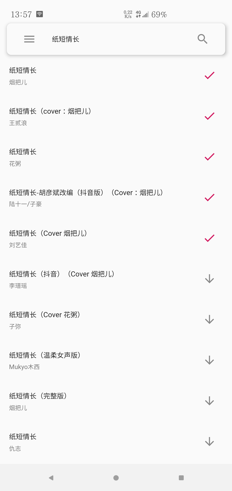
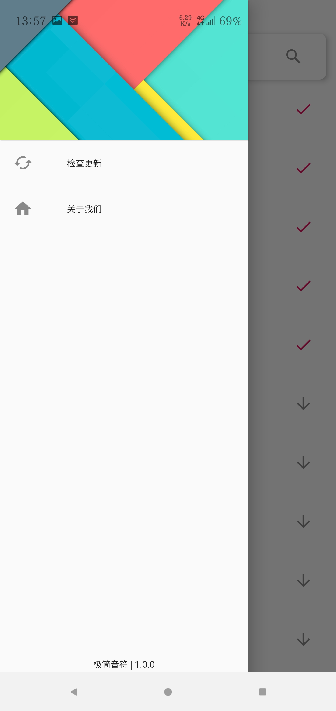

# 极简音符

> A Music Downloader by flutter! 

> 任何问题欢迎提issue

> 特别鸣谢：Bubblegum&Lemonade 提供友情赞助 图标！

<div align="center">  
    
    
    
</div>
<!--{:width="30px"}-->
<!---->
<!---->
## 简介 
刚刚学了学Flutter，然后打算做点什么，就做了这个。

整体设计只能是差强人意，希望以后能设计更好的界面吧。

借用[网易云API](https://github.com/Binaryify/NeteaseCloudMusicApi)开发的一个Flutter下载音乐应用.

## 使用 
```bash
git clone https://github.com/Littleor/Flutter_Music
cd Flutter_Music
flutter pub get
flutter run
#flutter build apk #打包APK
```
